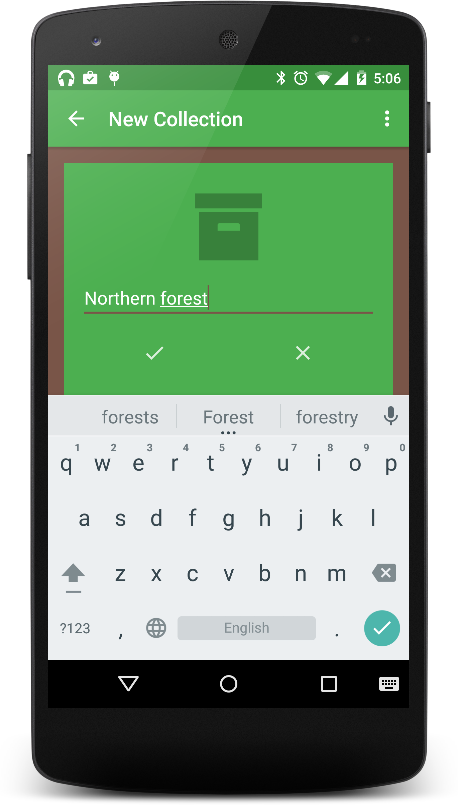
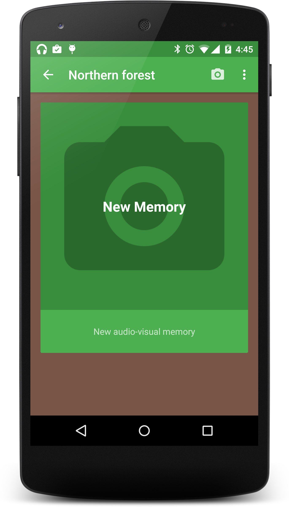
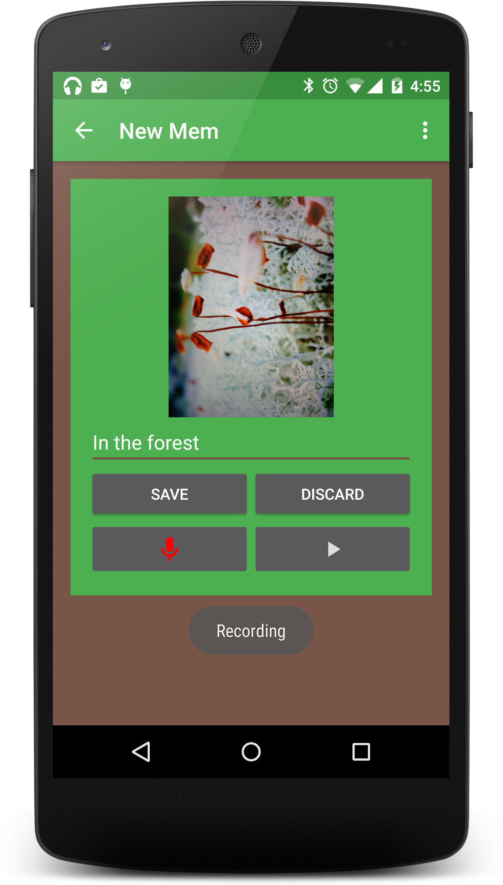
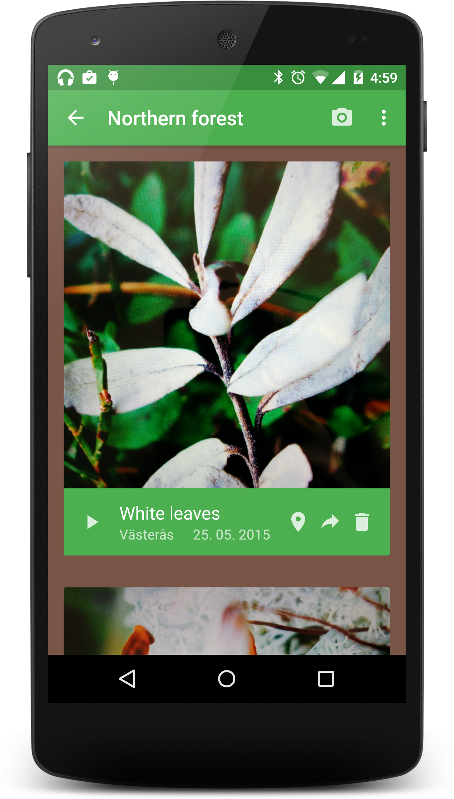
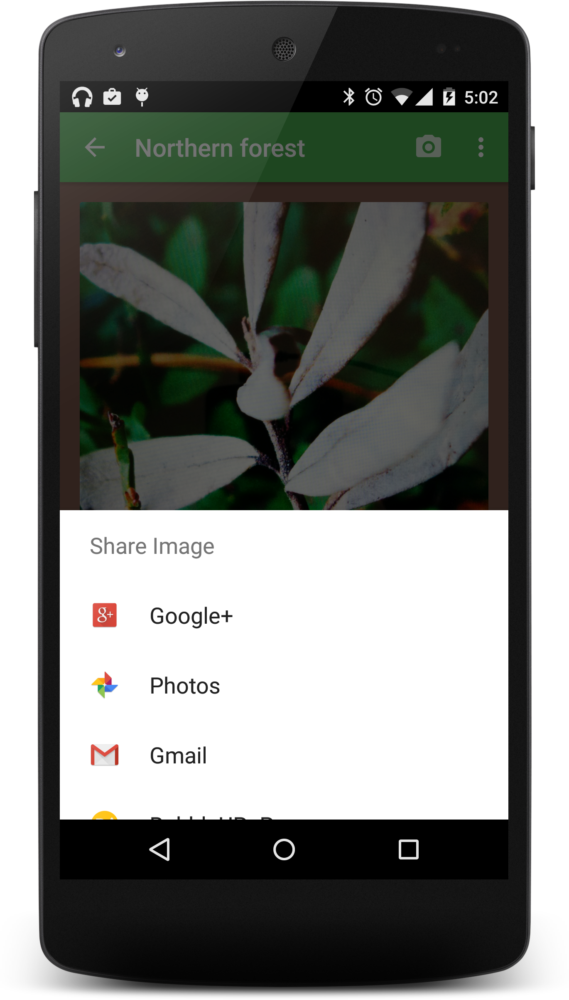
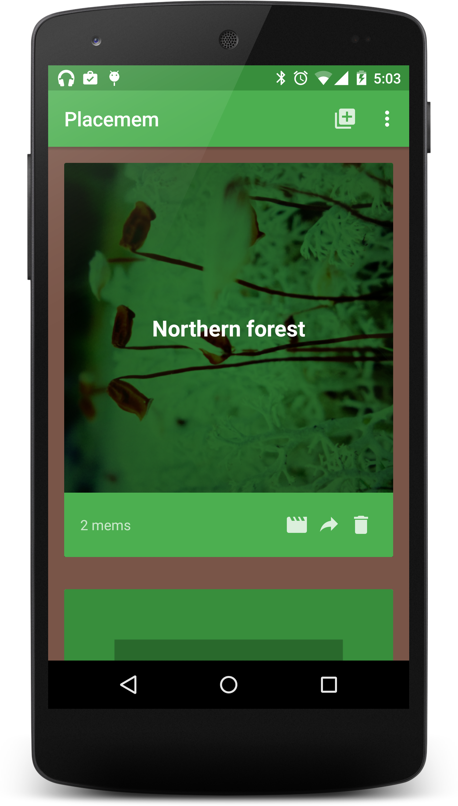

# Talking-Photos-on-Android
Android app development project for course DVA217 at Mälardalens University. The app can take photos and attach recorded audio to them, organize these photos into albums, play them as slideshows and share them as videos with other people.

## How to compile and run
- Use Android Studio

## Compatibility
- Works best on Android 5 and higher

## Documentation
- See "DVA217.-.Group.2.-.Project.Report.pdf"

## Screenshots

